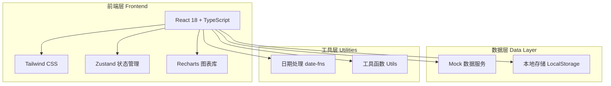

# 活动效果分析平台 - 技术架构文档

## 1. 架构设计



## 2. 技术栈说明

- **前端框架**：React 18 + TypeScript
- **构建工具**：Vite
- **样式方案**：Tailwind CSS 3 + CSS Variables
- **状态管理**：Zustand
- **路由管理**：React Router DOM 6
- **图表库**：Recharts（响应式图表）
- **图标库**：Lucide React
- **日期处理**：date-fns
- **数据持久化**：LocalStorage（模拟后端）

## 3. 路由定义

| 路由路径 | 页面名称 | 功能说明 |
|----------|----------|----------|
| `/` | 重定向到概览 | 默认跳转 |
| `/overview` | 活动概览 | 核心指标、趋势、人群分布 |
| `/channels` | 渠道分析 | 渠道对比、成本效益 |
| `/funnel` | 转化漏斗 | 转化路径、流失分析 |
| `/attendees` | 参会人明细 | 参会人列表、筛选 |
| `/reports` | 报告中心 | 报告生成、分享管理 |

## 4. 项目目录结构

```
src/
├── components/          # 公共组件
│   ├── common/         # 通用UI组件
│   │   ├── Card.tsx
│   │   ├── Button.tsx
│   │   ├── Select.tsx
│   │   ├── Input.tsx
│   │   └── Table.tsx
│   ├── charts/        # 图表组件
│   │   ├── LineChart.tsx
│   │   ├── BarChart.tsx
│   │   ├── PieChart.tsx
│   │   └── FunnelChart.tsx
│   └── layout/        # 布局组件
│       ├── Sidebar.tsx
│       ├── Header.tsx
│       └── Layout.tsx
├── pages/              # 页面组件
│   ├── Overview.tsx    # 活动概览
│   ├── Channels.tsx    # 渠道分析
│   ├── Funnel.tsx      # 转化漏斗
│   ├── Attendees.tsx   # 参会人明细
│   └── Reports.tsx     # 报告中心
├── hooks/              # 自定义Hooks
│   ├── useActivity.ts
│   ├── useAttendees.ts
│   └── useReports.ts
├── store/              # Zustand状态
│   ├── activityStore.ts
│   ├── attendeeStore.ts
│   └── reportStore.ts
├── data/               # Mock数据
│   ├── activities.ts
│   ├── attendees.ts
│   ├── channels.ts
│   └── reports.ts
├── types/              # TypeScript类型
│   ├── activity.ts
│   ├── attendee.ts
│   ├── channel.ts
│   └── report.ts
├── utils/              # 工具函数
│   ├── format.ts
│   ├── calculate.ts
│   └── export.ts
├── App.tsx             # 根组件
├── main.tsx            # 入口文件
└── index.css           # 全局样式
```

## 5. 数据模型定义

### 5.1 活动数据模型

```typescript
interface Activity {
  id: string;
  name: string;
  type: 'launch' | 'exhibition' | 'livestream';
  startDate: string;
  endDate: string;
  target: {
    registrations: number;
    checkIns: number;
    leads: number;
    deals: number;
  };
  budget: number;
  channels: Channel[];
  metrics: ActivityMetrics;
  createdAt: string;
  updatedAt: string;
}

interface ActivityMetrics {
  registrations: number;
  checkIns: number;
  viewers: number;
  interactions: number;
  leads: number;
  deals: number;
  dealAmount: number;
}

interface Channel {
  id: string;
  name: string;
  type: 'wechat' | 'weibo' | 'email' | 'sms' | 'ads' | 'offline' | 'other';
  cost: number;
  registrations: number;
  checkIns: number;
  leads: number;
  deals: number;
}
```

### 5.2 参会人数据模型

```typescript
interface Attendee {
  id: string;
  name: string;
  company: string;
  industry: string;
  city: string;
  customerLevel: 'A' | 'B' | 'C' | 'D' | 'new';
  status: 'registered' | 'checked-in' | 'viewed' | 'interacted' | 'lead' | 'deal';
  watchDuration: number;
  interactions: number;
  registeredAt: string;
  checkedInAt?: string;
  leadAt?: string;
  dealAmount?: number;
  channel: string;
  feedback?: Feedback;
}

interface Feedback {
  rating: number;
  comment: string;
  keywords: string[];
}
```

### 5.3 报告数据模型

```typescript
interface Report {
  id: string;
  activityId: string;
  title: string;
  createdAt: string;
  createdBy: string;
  sections: ReportSection[];
  notes: ReportNote[];
  shareSettings?: ShareSettings;
}

interface ReportSection {
  type: 'metrics' | 'chart' | 'table' | 'text';
  title: string;
  data: any;
}

interface ReportNote {
  id: string;
  content: string;
  createdAt: string;
  createdBy: string;
}

interface ShareSettings {
  enabled: boolean;
  link: string;
  expiresAt?: string;
  permissions: ('view' | 'export')[];
}
```

## 6. 核心组件设计

### 6.1 图表组件

使用 Recharts 库封装统一的图表组件：

- **MetricCard**：指标卡片，显示数值和趋势
- **TrendChart**：趋势折线图，支持时间范围选择
- **FunnelChart**：漏斗图，显示转化路径
- **DistributionChart**：分布图，支持饼图/柱状图切换
- **ComparisonChart**：对比图，支持多维度对比

### 6.2 数据表格组件

- **DataTable**：通用数据表格，支持排序、分页、搜索
- **FilterPanel**：筛选面板，支持多条件组合

### 6.3 报告生成组件

- **ReportBuilder**：报告构建器，步骤式向导
- **ReportPreview**：报告预览
- **ShareManager**：分享管理

## 7. 状态管理设计

使用 Zustand 进行状态管理，按功能模块划分：

```typescript
// activityStore.ts
interface ActivityState {
  currentActivity: Activity | null;
  activities: Activity[];
  setCurrentActivity: (id: string) => void;
  updateActivity: (data: Partial<Activity>) => void;
  addActivity: (activity: Activity) => void;
}

// attendeeStore.ts
interface AttendeeState {
  attendees: Attendee[];
  filters: AttendeeFilters;
  setFilters: (filters: AttendeeFilters) => void;
  getFilteredAttendees: () => Attendee[];
}

// reportStore.ts
interface ReportState {
  reports: Report[];
  currentReport: Report | null;
  createReport: (activityId: string) => void;
  updateReport: (id: string, data: Partial<Report>) => void;
  shareReport: (id: string, settings: ShareSettings) => void;
}
```

## 8. Mock数据设计

为演示目的，创建包含以下内容的Mock数据：

- 3个不同类型的活动（发布会、展会、直播）
- 200+条参会人数据
- 6种渠道来源数据
- 50+条问卷反馈数据
- 5份示例报告

## 9. 关键功能实现

### 9.1 数据导入

支持手动录入和JSON导入两种方式：
- 手动录入：表单填写活动基础信息
- JSON导入：批量导入参会人数据

### 9.2 数据导出

支持导出为以下格式：
- Excel (.xlsx)：参会人明细、渠道数据
- CSV：通用数据导出
- PDF：报告导出

### 9.3 报告分享

- 生成唯一分享链接
- 设置访问权限（仅查看/可导出）
- 设置有效期
- 支持二维码分享

## 10. 性能优化

- **虚拟列表**：参会人列表使用虚拟滚动
- **懒加载**：图表组件按需加载
- **数据缓存**：使用 LocalStorage 缓存活动数据
- **防抖节流**：搜索、筛选操作防抖处理